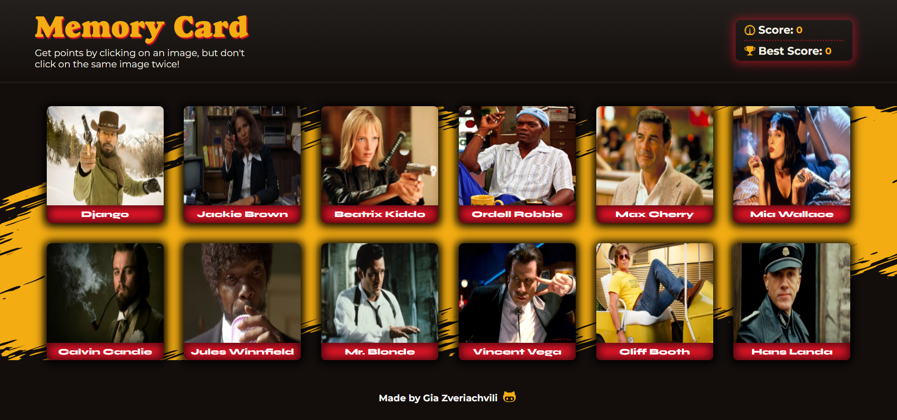

# Memory Card Game made with React

The purpose of this project is to enforce my learnings on lifecycle methods, functional components, and the use of hooks in React.
This project is part of [The Odin Project](https://www.theodinproject.com) curriculum.



[Live Demo](https://www.theodinproject.com)

## How to install

```
git clone git@github.com:gzveriachvili/memory-card-game.git
cd cv-application
npm install
npm start
```

### Built with

- [React](https://reactjs.org/)
- [react-icons](https://www.npmjs.com/package/react-icons)
